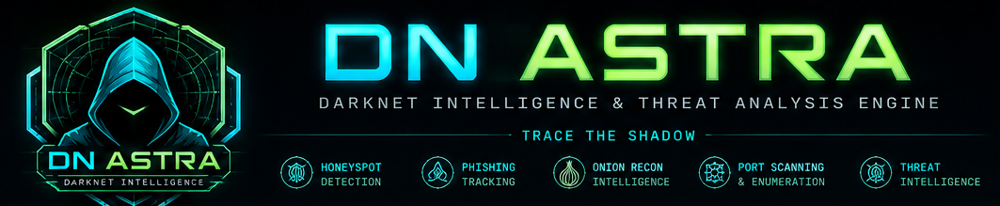
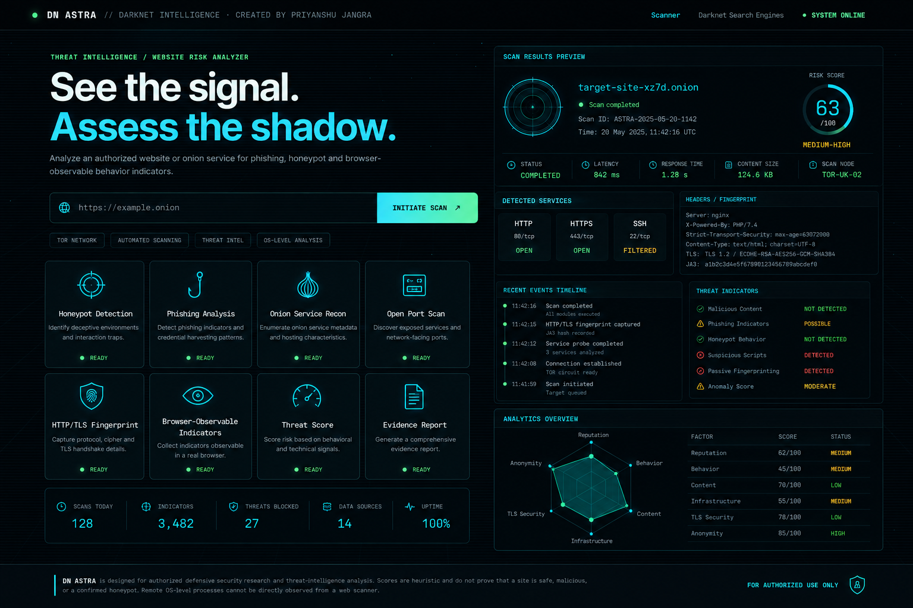

<p align="center">
  
</p>

<h1 align="center">Dark Net Astra</h1>

<p align="center">
  <strong>Cybersecurity • OSINT • Threat Intelligence • Dark-Web Research</strong>
</p>

<p align="center">
  An educational and research-oriented cybersecurity toolkit for studying
  online intelligence, threat ecosystems, OSINT workflows, and security research.
</p>

---

## ⚠️ IMPORTANT DISCLAIMER

**Dark Net Astra is an educational and defensive cybersecurity research project.**

This project must only be used for:

- Educational purposes
- Cybersecurity research
- Threat-intelligence research
- OSINT learning
- Defensive security analysis
- Systems and environments that you own
- Authorized security testing

Do **not** use this project to:

- Access systems without authorization
- Attack or disrupt websites, servers, or networks
- Steal credentials or personal information
- Identify or target individuals unlawfully
- Download, distribute, or interact with illegal material
- Evade law enforcement or security controls
- Perform unauthorized surveillance
- Conduct malicious cyber activity

The author is not responsible for misuse of this project.

**Always follow applicable laws, institutional policies, and the rules of the systems you are researching.**

---

# 🔭 What is Dark Net Astra?

**Dark Net Astra** is a cybersecurity research toolkit created to provide a centralized environment for learning about:

- Dark-web ecosystems
- Open-source intelligence (OSINT)
- Threat intelligence
- Cybersecurity investigations
- Online threat research
- Intelligence analysis
- Security research workflows

The goal is to make cybersecurity research easier to understand through a modern, interactive interface.

---

# ✨ Key Areas

### 🌐 Dark-Web Research

Provides an educational environment for understanding how hidden online services and dark-web ecosystems are studied from a cybersecurity perspective.

### 🔎 OSINT

Learn how publicly available information can be collected, organized, and analyzed during legitimate investigations.

### 🛡️ Threat Intelligence

Study indicators, threat information, attack patterns, and intelligence workflows used by defensive security teams.

### 🧠 Intelligence Analysis

Organize information and develop a structured understanding of security-related events and online threats.

### 🔬 Cybersecurity Research

Use the project as a learning environment for experimenting with cybersecurity concepts and research workflows.

### 🖥️ Security Dashboard

A modern security-focused interface designed to bring research utilities and intelligence information into one place.

---

## 🖥️ Dashboard 

<p align="center">  </p> <p align="center"> <em>Dark Net Astra — Cybersecurity Intelligence Dashboard</em> </p>

# 🎯 Project Objective

Dark Net Astra was created with a simple objective:

> **Explore. Analyze. Understand.**

The project helps students, researchers, and cybersecurity enthusiasts understand how OSINT, threat intelligence, and online security research work together.

It is intended to be a **learning and defensive research project**, not a tool for unauthorized activity.

---

# 🧪 Recommended Research Environment

For cybersecurity experimentation, it is strongly recommended to keep your research environment isolated from your everyday computer.

A good learning setup is:

```text
Your Computer
      │
      ▼
Virtual Machine
      │
      ├── Research Tools
      ├── Test Data
      └── Cybersecurity Lab

# DN ASTRA Tor configuration

The scanner supports an opt-in HTTP/SOCKS proxy through the `DN_ASTRA_TOR_PROXY` environment variable.

Example concept (do not expose the proxy publicly):

    DN_ASTRA_TOR_PROXY=socks5://127.0.0.1:9050

Run Tor locally or in an isolated container, then start FastAPI. Keep the scanner isolated from the host and restrict egress/resources in production.
````

## Why use a Virtual Machine?

A VM provides an additional layer of isolation between your normal computer and your cybersecurity laboratory.

Examples of virtualization software include:

* VirtualBox
* VMware Workstation
* Hyper-V

For a dedicated cybersecurity lab, you can use a Linux-based virtual machine.

### Recommended Lab Practices

* Keep the VM updated.
* Use non-personal test accounts.
* Avoid storing sensitive personal information.
* Keep research files inside the lab.
* Take VM snapshots before experiments.
* Do not connect unknown or suspicious files directly to your host system.
* Use a separate test environment for security experiments.
* Keep backups of important research data.

---

# 🔐 Isolation & Safety

When conducting cybersecurity research:

### 1. Separate your laboratory

Use a dedicated VM or isolated test environment whenever possible.

### 2. Use synthetic data

Prefer:

```text
Fake usernames
Fake domains
Test credentials
Dummy documents
Sample indicators
Non-sensitive datasets
```

instead of real personal information.

### 3. Do not investigate real people without authorization

OSINT research can expose sensitive information.

Only perform investigations when there is a legitimate and authorized reason.

### 4. Do not interact with suspicious services

If research material appears malicious, illegal, or unsafe, do not download, execute, or interact with it.

### 5. Protect your identity and accounts

Never use your personal credentials, personal documents, or sensitive accounts inside an experimental environment.

---

# 🧭 Suggested Learning Workflow

A safe cybersecurity research workflow can look like this:

```text
Define Research Question
          │
          ▼
      Collect Data
          │
          ▼
     Verify Sources
          │
          ▼
   Analyze Information
          │
          ▼
 Identify Security Context
          │
          ▼
   Document Findings
          │
          ▼
     Defensive Action
```

Always verify information before treating it as an intelligence finding.

---

# 📚 Educational Use Cases

Dark Net Astra can be used for studying:

* OSINT methodologies
* Threat intelligence concepts
* Cyber threat research
* Security investigations
* Digital intelligence
* Information verification
* Threat actor research at a conceptual level
* Security reporting
* Cybersecurity awareness
* Defensive security workflows

---

# 🚀 Getting Started

Clone the repository:

```bash
git clone https://github.com/Cyber-knose/DN-Astra
```

Enter the project directory:

```bash
cd DN-Astra
```

Then open the application's main HTML file in a browser, or use a local development server if the project requires one.

For example:

```bash
python -m http.server 8000
```

Then access the application through your local browser.

> Use only the features and data sources that are legal and authorized in your environment.

---

# 🧰 Research Lab Recommendations

For students and beginners, a safe cybersecurity lab can contain:

```text
Virtual Machine
│
├── Linux Environment
├── Test Dataset
├── Sample Logs
├── Dummy Accounts
├── Local Test Services
└── Dark Net Astra
```

This allows cybersecurity concepts to be studied without placing your primary computer, accounts, or personal data at unnecessary risk.

---

# 📖 Learning Topics

If you are learning cybersecurity through Dark Net Astra, useful topics to study alongside the project include:

* OSINT
* Threat Intelligence
* Network Security
* Web Security
* Digital Forensics
* Incident Response
* Privacy & Security
* Security Operations
* Risk Assessment
* Intelligence Analysis

---

# ⚖️ Responsible Research

Cybersecurity research should always follow three principles:

### Authorization

Only investigate systems, accounts, networks, or data that you have permission to access.

### Minimization

Collect only the information necessary for the legitimate research objective.

### Documentation

Keep clear records of your methodology, sources, findings, and limitations.

---

# 👨‍💻 Author

**Priyanshu Jangra**

Dark Net Astra

> **Explore. Analyze. Understand.**

---

# 📜 License & Responsible Use

Before publishing or redistributing this project, review the repository's license and applicable laws.

This project is provided for educational, research, and defensive cybersecurity purposes.

**Unauthorized use is strictly discouraged.**

---

<p align="center">
  <strong>Dark Net Astra</strong><br>
  Explore • Analyze • Understand
</p>
```


## ⚡ Tech Stack

<p align="center">


</p>


### 🧬 Technology Architecture

<table align="center">
<tr>
<td align="center" width="200">

### 🐍 Python

Backend &  
application logic

</td>

<td align="center" width="200">

### 🌶️ Flask

Web server &  
REST API layer

</td>

<td align="center" width="200">

### 🌐 HTML5

Frontend structure &  
application layout

</td>
</tr>

<tr>
<td align="center" width="200">

### 🎨 CSS3

UI styling,  
animations & responsive design

</td>

<td align="center" width="200">

### ⚡ JavaScript

Interactive components &  
frontend functionality

</td>

<td align="center" width="200">

### 📦 JSON

API communication &  
structured data exchange

</td>
</tr>
</table>

---

### 🔧 Backend

```text
Python
   │
   ├── Flask
   │    ├── Routes
   │    ├── REST API
   │    └── Request Handling
   │
   ├── Application Logic
   └── Data Processing
````

### 🖥️ Frontend

```text
HTML5
  │
  ├── Application Layout
  │
CSS3
  │
  ├── Dark Cybersecurity UI
  ├── Responsive Design
  └── Animations
  │
JavaScript
  │
  ├── Interactive Components
  ├── API Requests
  └── Dynamic Data
```

### 🔗 API & Data Layer

```text
Frontend
    │
    │ HTTP / HTTPS
    ▼
Flask REST API
    │
    ▼
Python Application Logic
    │
    ▼
JSON Response
    │
    ▼
Frontend Dashboard
```

---

### 📦 Development Stack

| Layer               | Technology                 |
| :------------------ | :------------------------- |
| **Backend**         | Python + Flask             |
| **API**             | REST API                   |
| **Frontend**        | HTML5 + CSS3 + JavaScript  |
| **Templates**       | Jinja2                     |
| **Data Format**     | JSON                       |
| **Web Protocol**    | HTTP / HTTPS               |
| **Version Control** | Git                        |
| **Repository**      | GitHub                     |
| **Environment**     | Python Virtual Environment |

---

### 🚀 Why This Stack?

**Python + Flask** provides a lightweight and flexible backend for cybersecurity research applications.

**HTML + CSS + JavaScript** provide a responsive and interactive interface for the Dark Net Astra dashboard.

**REST API + JSON** allow the frontend and backend to communicate through a clean and structured architecture.

**Git + GitHub** make development, version control, collaboration, and project distribution easier.
